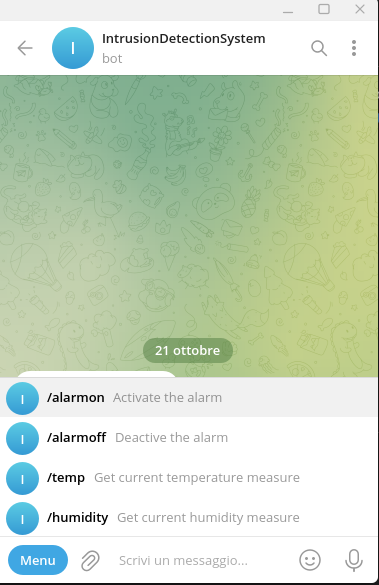

# IntrusionSystemPicoBot
Intrusion system based on Raspberry Pi Pico W, interfaced with a Telegram Bot for commands and alerts.

	

## Introduction 
The objective of this project is to realize an **intrusion detection system** based on [*Raspberry Pi Pico W*](https://www.raspberrypi.com/products/raspberry-pi-pico/) with the following functionalities: 
- motion detection; 
- temperature measurement; 
- humidity measurement. 

Allowed users can interact with the system by the telegram bot, requiring current temperature/humidity value and activating/deactivating the alarm. The alarm state (active/not active) is visible by means of green and red LEDs on top of the plastic box containing all the components (not visible in the photo). 

In the following screenshots, an overview of the available commands and an example of interaction with the bot is shown. 

	
    

## Components 
- *Raspberry Pi Pico W*: be careful to buy the W version, otherwise additional WiFi peripherals may be needed; 
- *DHT11* Sensor (humidity and temperature sensor);
- *PIR Motion Sensor*;
- *Green* and *Red* *LEDs*;
- 1 k $\Omega$ *Resistor*; 
- *Wires* and *Jumpers*;
- (Optional) Plastic Box for organizating and holding all components.

## Repository Organization 
Important repository files are: 
- *main.py*: principal file, executed by the Raspberry Pi Pico W at startup (be careful to name it properly); 
- *Dht11.py*: DHT11 Sensor Python Class;
- *credentials.json*: JSON-formatted file for WiFi credentials and Telegram Bot tokens and Chat IDs;
- *logs.json*: JSON-formatted file storing the last processed message ID;
- *README.md*: this README file; 
- *images*: images for documentation.

## Instructions
If you want to use this repository as is, copy all .py and .json file in your RPi Pico W mass storage (prepare your board using [this procedure](https://projects.raspberrypi.org/en/projects/get-started-pico-w/1)) and connect according to the circuit scheme reported in the photo above. You may exchange PINs without problems (be careful to [RPi Pico W Pinout Diagram](https://datasheets.raspberrypi.com/picow/PicoW-A4-Pinout.pdf)). 

## Contacts

If you wish to reach me, suggest or ask me anything, feel free to contact me at [cosimo.bromo@gmail.com](mailto:cosimo.bromo@gmail.com). 